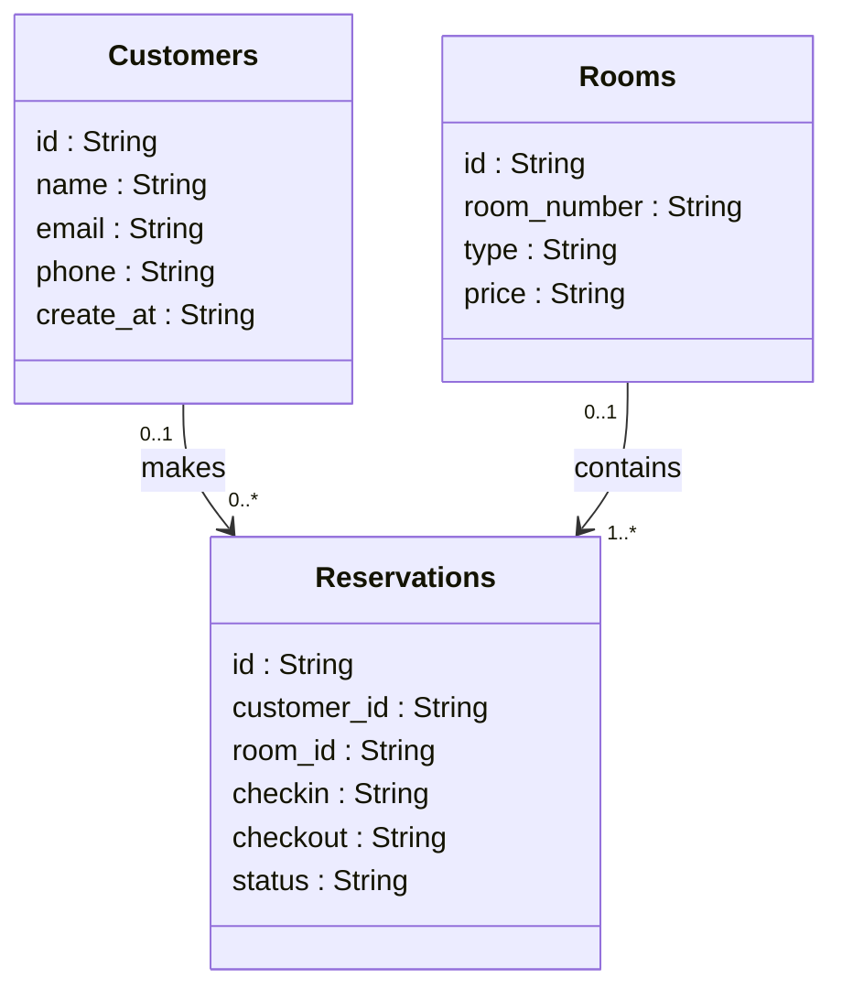

# Sistema de Gerenciamento de Reservas

## Descrição
Este é um sistema de reservas de hotel desenvolvido com Spring Boot, que permite a criação, gerenciamento e cancelamento de reservas. Ele utiliza JPA para persistência de dados e fornece uma API RESTful para interação com o sistema.

## Modelo Lógico


## Pré-requisitos
- JDK 17
- Gradle

## Tecnologias Utilizadas
- Spring Boot 3.3.2
- Spring Data JPA
- Spring Web
- H2 Database (runtime)
- Springdoc OpenAPI (para documentação da API)
- JUnit (para testes)

### Dependências
```gradle
dependencies {
	implementation 'org.springframework.boot:spring-boot-starter-data-jpa'
	implementation 'org.springframework.boot:spring-boot-starter-web'
	implementation 'org.springdoc:springdoc-openapi-starter-webmvc-ui:2.1.0'
	runtimeOnly 'com.h2database:h2'
	runtimeOnly 'org.postgresql:postgresql'
	testImplementation 'org.springframework.boot:spring-boot-starter-test'
	testRuntimeOnly 'org.junit.platform:junit-platform-launcher'
	testImplementation 'ch.qos.logback:logback-classic:1.5.6'
}
```

## Como Executar
1. Clone o repositório:
   ```bash
   git clone https://bitbucket.org/heloisacampos/javaestagiarioheloisafelizardo/src/main/
   ```
2. Navegue até o diretório do projeto:
   ```bash
   cd javaestagiarioheloisafelizardo/src/main/
   ```
3. Execute o projeto no arquivo Application:
   ```bash
   ./mvnw spring-boot:run
   ```
4. Acesse a documentação da API:
    - URL da API: `http://localhost:8080`
    - URL do banco de dados H2: `http://localhost:8080/h2-console`
    - Documentação Swagger: `http://localhost:8080/swagger-ui.html`

5. Para acessar o banco h2:
    - url: jdbc:h2:mem:akross
    - username: akross
    - password:

## Estrutura do Projeto
- **controller**: Contém os controladores REST.
- **service**: Contém as interfaces e implementações de serviços.
- **repository**: Contém os repositórios JPA.
- **model**: Contém as entidades JPA.
- **dto**: Contém os objetos de transferência de dados.

## Funcionalidades
- Criação de reservas
- Cancelamento de reservas
- Listagem de reservas por data
- Listagem de quartos disponíveis
- Listagem de clientes com maior histórico de reservas


Desenvolvido por [Heloisa Felizardo].
```
